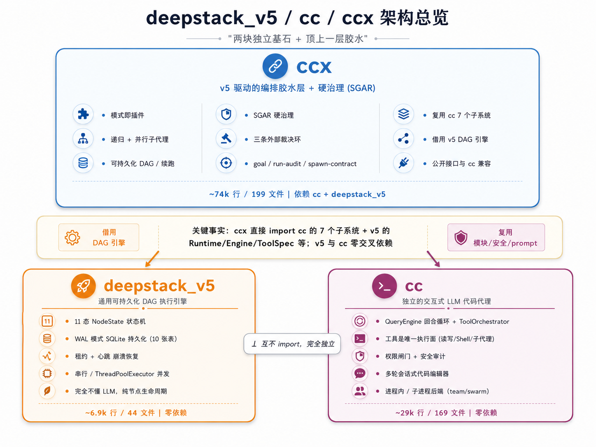

# sgar: 状态治理agent模式 / State-Governed Agent Regime

[English Version](./README.en.md)

`sgar` 是一个 embedded coding agent，用来把自动化修复、自动化运维与长程代码编辑能力
嵌入到你的系统中。

我们相信，几乎每个项目最终都需要一个内嵌 agent，不是只在开发机里调用一次，而是部署在业务环境
里，围绕真实业务数据持续做 `auto research`、`self-improving`、`self-operation`。

它同时是：

- 一个 openclaw 的长程代码编辑技能
- 一个可以独立使用的 CLI 长程代码编辑工具
- 一个可嵌入你自己系统的 agent runtime，让你的系统具备持续修复、持续迭代、持续维护能力

`sgar` 不只是“调用一次 LLM 写点代码”，而是把代码编辑、状态治理、阶段推进、审计验证和
运行痕迹组合成一个可长期运行的 agent 模型。

## 架构总览



## 核心思想

`sgar` 的设计建立在两篇核心文档之上：

- [审计工程](https://github.com/wxy2ab/against-llm-mediocrity/blob/main/docs/audit-engineering.zh-CN.md)
- [状态治理agent模式](https://github.com/wxy2ab/against-llm-mediocrity/blob/main/docs/state-governed-agent-regime.zh-CN.md)

- `Audit Engineering`：把“能生成”变成“能持续修正”。利用 LLM 的生成-验证不对称性，以及“缺陷诊断本身就是改进药方”这一事实，让 agent 在长程运行中越跑越准，而不是越跑越飘。
- `State-Governed Agent Regime`：把 agent 从“靠提示词漂移”变成“靠硬状态推进”。用外部化状态约束运行轨迹，用 `action` 和 `delta` 驱动每一步改进，让长程执行可控、可追踪、可迭代。

如果你想理解为什么 `sgar` 强调审计、状态、阶段切换和长程运行，建议先读这两篇文档。

## 重新定位

你可以把 `sgar` 理解为三层能力的统一封装：

- `Embedded Coding Agent`：把现代代码编辑能力嵌入现有系统、平台、机器人或自动化流水线
- `OpenClaw Long-Range Skill`：让 OpenClaw 拥有长程稳定的 coding agent
- `Standalone CLI`：直接在仓库里运行，用命令行驱动长程规划、执行、验证与收敛

这意味着 `sgar` 既可以作为单独工具使用，也可以作为你系统内部的一个代码修复/治理组件使用，
最终演化成部署环境里的内嵌 agent。

## 优势

`sgar` 的核心优势包括：

1. 长程运行的 agent  
   `sgar` 不只关注单次回答，而是支持阶段化推进、跨步骤执行、状态持续保存与长链路收敛。

2. 把现代化代码编辑能力集成到你的系统  
   你可以把 `sgar` 嵌入自己的平台与部署环境，让系统围绕真实业务数据持续做 `auto research`、
   `self-improving`、`self-operation`，而不只是离线生成一次代码。

3. 基于审计的可靠迭代  
   `sgar` 把验证、证据、痕迹和可追踪性视为一等能力，而不是“写完代码就结束”。

4. 基于 SGAR 的硬状态运行模型  
   `sgar` 用显式状态与阶段切换约束 agent 行为，降低长程运行中的漂移、跳步和失控风险。

## 安装

要求：

- Python `>= 3.12`

安装：

```bash
pip install sgar
```

安装完成后可使用以下入口：

```bash
sgar --help
python -m sgar --help
```

## 文档导航

如果你希望把首页当成产品概览，把更完整的说明下沉到 `docs/`，建议从下面几份文档继续：

- [构架文档](./docs/architecture.md)
- [使用文档](./docs/usage.md)
- [API 文档](./docs/api.md)
- [集成文档](./docs/integration.md)

## 配置

### 方式一：使用 `sgar config`

最推荐的方式是通过 CLI 写入用户级配置文件：

```bash
sgar config where
sgar config list
sgar config set --client SimpleDeepSeekClient --api-key YOUR_KEY --model deepseek-v4-pro
```

这会把配置写入：

```text
~/.sgar/setting.ini
```

典型内容如下：

```ini
[Default]
llm_api = SimpleDeepSeekClient
cc_default_llm_client = SimpleDeepSeekClient
deepseek_api_key = YOUR_KEY
deepseek_model = deepseek-v4-pro
```

`sgar config list` 会列出当前分发支持的 `ClientName`、凭证键、模型键和示例命令。

如果某个 client 只有一个凭证键，可以直接使用 `--api-key`。如果某个 client 需要多个凭证
或连接参数，请改用可重复的 `--key`：

```bash
sgar config set --client SparkClient \
  --key xunfei_spark_api_key=YOUR_KEY \
  --key xunfei_spark_secret_key=YOUR_SECRET \
  --model 4.0Ultra
```

### 方式二：手工编辑 `setting.ini`

你也可以自己创建配置文件：

```ini
[Default]
llm_api = SimpleDeepSeekClient
cc_default_llm_client = SimpleDeepSeekClient
deepseek_api_key = YOUR_KEY
deepseek_model = deepseek-v4-pro
```

当前实现中的读取优先级为：

1. 环境变量
2. 当前工作目录下的 `setting.ini`
3. 用户目录下的 `~/.sgar/setting.ini`

也就是说，只要环境变量里存在同名键，例如 `DEEPSEEK_API_KEY`，它会覆盖文件中的值。

## 使用方法

更完整的命令路径、工作区说明与典型任务流，建议直接阅读 [使用文档](./docs/usage.md)。下面保留的是首页级概览。

### 最简单的用法

- `sgar`：标准的长程稳定 coding agent 工作流，适合初始化、查看状态、诊断问题、查看轨迹
- `sgarx`：扩展模式，适合需要更强阶段恢复能力的场景；它的数据落在 `.sgarx/`，通常作为集成模式使用，而不是单独的顶层 CLI 命令

如果你只想快速把 `sgar` 跑起来，最短路径就是：

```bash
sgar config set --client SimpleDeepSeekClient --api-key YOUR_KEY --model deepseek-v4-pro
sgar init --project my-repo
sgar status
```

几个最常用的日常动作：

```bash
sgar status   # 看当前阶段和项目状态
sgar doctor   # 看工作区是否缺文件、状态是否异常
sgar trace    # 看最近的运行轨迹
```

执行 `sgar init` 后，会在当前仓库下生成一个 `.sgar/` 工作区，保存 agent 的硬状态与治理
文档，例如：

如果仓库根目录已经存在 `.gitignore`，`sgar init` 还会自动补入：

```text
.sgar/
.sgarx/
```

```text
.sgar/
  config.json
  state.json
  blueprint.md
  roadmap.md
  stages/
    stage-01/
      spec.md
  missions/
```

如果你传入 `--session <id>`，则会把状态隔离到：

```text
.sgar/sessions/<id>/
```

### 进阶用法

查看帮助：

```bash
sgar --help
sgar config --help
python -m sgar --help
```

初始化与状态查看：

```bash
sgar init --project my-repo
sgar status
sgar trace
sgar doctor
```

写入或生成治理文档：

```bash
sgar set-blueprint --text "..."
sgar set-roadmap --text "..."
sgar set-stage-spec --stage stage-01 --text "..."

sgar draft-blueprint --llm-client SimpleDeepSeekClient --prompt "为这个仓库生成 blueprint"
sgar draft-roadmap --llm-client SimpleDeepSeekClient --prompt "拆解阶段路线图"
sgar draft-stage-spec --stage stage-01 --llm-client SimpleDeepSeekClient --prompt "细化 stage-01"
```

验证与阶段推进：

```bash
sgar validate blueprint --accept
sgar validate roadmap --accept
sgar validate stage --stage stage-01
sgar start-stage stage-01
sgar verify --stage stage-01 --criterion c1 --pass --evidence "pytest tests/test_api.py -q"
sgar close-stage stage-01
```

启用可机器检查的退出准则：

```bash
sgar --run-checks --check-timeout 120 verify --stage stage-01 --all-pass --evidence "all checks passed"
```

隔离 mission：

```bash
sgar mission create \
  --kind patch \
  --id fix-login \
  --input src/auth.py \
  --objective "修复登录超时问题" \
  --expected-output patch.diff

sgar mission status fix-login
sgar mission list
```

## 集成到代码

如果你正在评估如何把 `sgar` 接进平台、服务、流水线或机器人，建议先阅读 [集成文档](./docs/integration.md)。下面保留的是首页级示例。

`sgar` 提供两类集成方式：

- SGAR 状态治理运行时：适合把阶段、规范、验证和痕迹管理嵌入你的系统
- Embedded Coding Agent API：适合把代码编辑/自动修复能力嵌入你的产品或服务

需要注意当前分发的导入面：

- `sgar` CLI 与 `python -m sgar` 对应的是独立命令行入口
- `from sgar import SgarRuntime` 对应的是 SGAR 状态治理运行时
- `from core.cc.api import ...` 对应的是嵌入式代码编辑 agent API

### 方式一：嵌入 SGAR 状态运行时

```python
from sgar import SgarRuntime

runtime = SgarRuntime("/path/to/repo")
runtime.init(project_name="demo-project")

runtime.set_blueprint(
    """
    # Problem
    Need a governed repair workflow.
    """
)
runtime.set_roadmap(
    """
    - stage-01: stabilize tests
    """
)
runtime.set_stage_spec(
    "stage-01",
    """
    # Objective
    Make the failing tests pass.
    """,
)

print(runtime.status())
```

这种方式适合你自己控制外层编排，把 `sgar` 作为内部的状态机和治理内核。

### 方式二：嵌入代码编辑 agent

如果你要把自动化修复、自动化改码能力直接接进你的系统，推荐使用 `core.cc.api`：

```python
from core.cc.api import build_code_with_agent

result = build_code_with_agent(
    goal="修复仓库中的 failing tests，并更新必要文档",
    cwd="/path/to/repo",
    context_paths=[
        "README.md",
        "src/app.py",
        "tests/test_app.py",
    ],
    constraints=[
        "保留现有公开 API",
        "优先做最小必要修改",
    ],
    acceptance_criteria=[
        "pytest tests/test_app.py -q 通过",
        "行为变化必须同步更新 README",
    ],
    prompt_language="zh",
)

print(result.final_text)
print(result.tool_call_count)
print(result.failed, result.error_message)
```

如果你只想直接发送一个指令，也可以使用更轻量的同步包装：

```python
from core.cc.api import run_code_agent

result = run_code_agent(
    "检查仓库中的回归问题，修复后运行相关测试，并给出最终总结",
    cwd="/path/to/repo",
    prompt_language="zh",
)

print(result.final_text)
```

## 适合什么场景

`sgar` 适合以下场景：

- 把代码修复 agent 集成到现有研发平台、内部工具、机器人或运维系统
- 为具体项目配置一个部署环境里的内嵌 agent，让它根据业务数据持续研究、改进与操作
- 在仓库里运行一个带审计能力的长程代码编辑流程
- 为自动化修复提供状态治理、阶段推进、可验证证据和可回溯痕迹
- 构建“能持续维护自己代码”的工程系统，而不只是一次性生成代码

如果你需要的是短链路问答型助手，`sgar` 可能不是最小工具；如果你需要的是长期运行、可治理、
可嵌入、可审计的代码 agent，`sgar` 正是为这件事设计的。
